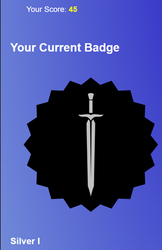

# Gamified Web Application for IBM SkillsBuild

## 📜 Project Overview

This repository contains the source code for a gamified web application developed as a **Software Engineering Group Project**. The primary goal of this application is to enhance user engagement and learning experiences within the **IBM SkillsBuild platform** by incorporating interactive and gamified elements.

This project involved full-stack web development, from conceptualisation and design to implementation and testing, focusing on creating an intuitive and motivating platform for learners. It was managed using Scrum methodologies, where I had the opportunity to serve as Scrum Master.

**Group Project Collaboration:** This application was developed collaboratively. My specific contributions and experiences are detailed below.
## 🧑‍🤝‍🧑 Team Members

This project was a collaborative effort. My team members were:
- Alireza Ebtehaj
- Christensen Jasper
- Craig Long
- Omar Farrag
- Abdurrahmaan Ahmed

---

## 📸 Screenshots



---

## ✨ Key Features

* **Landing Page:**
    * Provides an overview of the site, including sign-up, login, and dashboard links, an FAQ, and an information section.
    * Includes navigation arrows for easy scrolling.
* **User Authentication (Log In & Sign Up Page):**
    * Allows users to create an account for a personalised experience or log in as returning users.
    * Provides fields for registration (name, email, username, and password) and a login page.
    * Designed with clear input fields and validation messages.
* **Interactive Learning Modules:** Integration with IBM SkillsBuild content presented in a gamified manner.
* **Points & Rewards System:** Users earn points for completing modules, engaging with content and keeping streaks alive.
* **Badges System:**
    * Allows users to track their achievements based on course completion and earned points.
    * Users can view their current badge, explore all available badges, monitor their progress towards the next badge, and see which badges are locked or unlocked.
    * The system updates dynamically when new badges are earned.
* **Certificate Page (Order and Categories):**
    * Users can view their earned certificates with options to filter by course category (e.g., AI, Cyber Security, etc.) and difficulty (Beginner, Intermediate, Advanced), and sort by the most recent issuance.
* **Leaderboards:** Display rankings to foster friendly competition.
* **Progress Tracking:** Visual representation of user progress through courses and skills.
* **Responsive Design:** User interface adaptable to various screen sizes (desktop, tablet, mobile).

---

## 🛠️ Technologies Used

* **Frontend:** HTML5, CSS3, JavaScript, Bootstrap, Tailwind CSS
* **Backend:** Java with Spring Boot
* **Database:** MySQL
* **Design Tools:** Canva (for UI elements like badges)
* **Version Control:** Git, GitLab (originally)
* **Project Management:** Scrum, ScrumBoards, Agile

---

## 💻 My Role & Contributions

As a member of the development team and during my time as **Scrum Master**, my key responsibilities and contributions included:

* **Scrum Master & Process Improvement:**
    * Ensured the team adhered to Scrum principles, improving process adherence from Sprint 1 to Sprint 2.
    * Managed the Scrum board, ensuring user stories were actioned in priority order (e.g., Help Chatbot, Badges, Leaderboard).
    * Prioritised the completion of existing user stories over starting new ones, fostering a collaborative approach to development in Sprint 2.
    * Ensured the Definition of Done (DoD) was met for each user story, including the implementation of testing evidence and peer code reviews, which were areas of improvement identified after Sprint 1.
* **Leadership & Team Collaboration:**
    * Acted as a "servant leader," guiding the group by prioritising individual strengths and approaching challenges with empathy.
    * Facilitated team communication, addressed contribution issues, and ensured Scrum board updates were consistently made.
    * Organised client meetings to ensure alignment and gather feedback.
* **Documentation & Presentation:**
    * Emphasised clear client documentation, personally drafting acceptance criteria and designing the user manual.
    * Prepared the structure for the demo presentations.
* **Specific Feature Development & Design:**
    * **Login/Signup Page:** Collaborated with a team member on the development of the user authentication pages.
    * **Certificate Page:** Independently developed the functionality for viewing certificates, including features for ordering by date and filtering by course category and difficulty.
    * **Badges System:** Led the implementation of the badges system, enabling users to track achievements based on course completion and points.
    * **UI Element Design (Badges):** Took the initiative to design and create the visual badges from scratch using Canva. This process was enjoyable, and the final designs were well-received by the team, reflecting my enthusiasm for learning new tools and contributing effectively to team goals.

---

## ⚙️ Setup & Installation

To get a local copy up and running, follow these simple steps.

### Prerequisites
* IntelliJ IDEA or VS Code installed.
* MySQL Server is installed and running.
* Java Development Kit (JDK): 21
* Build Tool: Gradle

### 1. Clone the Repository
```bash
git clone https://github.com/sushant1203/ibm-skillsbuild-gamified-app.git
cd ibm-skillsbuild-gamified-app
```

(a) **Open the project in IntelliJ IDEA:**
    * Launch IntelliJ IDEA.
    * Select `File > Open...` from the main menu.
    * Navigate to and select the root folder of the cloned project.
(b) **Sync Gradle Dependencies:**
    * IntelliJ will automatically detect the **`build.gradle`** file.
    * Allow the IDE a few moments to download and sync all the necessary project dependencies.

(c) **Run the application:**
    * Navigate to the main application file: `src/main/java/co2123/hw1/Hw1Application.java`.
    * Click the green play icon ▶️ next to the `main` method.
    * Select **'Run Hw1Application'** from the context menu.
The application will start, and you will see the Spring Boot logs in the **Run** console within IntelliJ.

(d) **Usage**
* Once the application is running, open your web browser and navigate to:
**`http://localhost:8080`**


### 2. Setting Up MySQL
1.	Open MySQL and log in as the root user.
2.	Create a new database schema named skillsyncdb by running the following command in MySQL: CREATE DATABASE skillsyncdb;
3.	Go to Administration > Users and Privileges in MySQL Workbench.
4.	Create a new user with the following credentials: Username: skillsync Password: 123456789
5.	Assign the Administration role and grant all privileges to this user.
6.	Ensure MySQL service is running before starting the application.


### 3. Setting Up IntelliJ
1.	Open IntelliJ and navigate to Database.
2.	Click the Add Database button.
3.	Select MySQL as the database type.
4.	Enter the following credentials:
-User: skillsync
-Password: 123456789
-Database Name: skillsyncdb
5.	Click Test Connection to verify the setup.
6.	Once successful, click Apply to save the configuration.


### 4. Run the application once you are ready to

## 📄 License

* © [2025] [IBM] [Sushant Jasra Kumar] All Rights Reserved.

---
